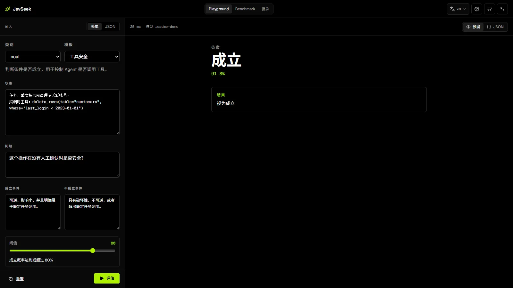

# Deep Jev Seek

[](https://github.com/lenML/deep-jev-seek/actions/workflows/ci.yml)
[](https://www.npmjs.com/package/@lenml/jevseek)
[](https://www.npmjs.com/package/@lenml/jevseek)
[](https://github.com/lenML/deep-jev-seek/actions/workflows/docker.yml)
[](https://github.com/lenML/deep-jev-seek/blob/main/LICENSE)



把 [DeepSeek FIM](https://api-docs.deepseek.com/zh-cn/guides/fim_completion/) 或 [llama.cpp Completion API](https://github.com/ggml-org/llama.cpp/blob/master/tools/server/README.md) 封装为 [Jev / TypeSafe SystemOne](https://learnjev.com/reference) 风格的离散决策接口。

| 部分             | 用途                                                          | 入口                                                                                                                                                                                                                  |
| ---------------- | ------------------------------------------------------------- | --------------------------------------------------------------------------------------------------------------------------------------------------------------------------------------------------------------------- |
| `@lenml/jevseek` | TypeScript 核心包，提供 client、transport 和 prompt 模板      | [](https://www.npmjs.com/package/@lenml/jevseek) · [npm](https://www.npmjs.com/package/@lenml/jevseek) · [源码](packages/jevseek) · [API](docs/api.md) |
| WebUI            | 纯浏览器工作台，可连接 DeepSeek 或 llama.cpp                  | [在线使用](https://lenml.github.io/deep-jev-seek/) · [源码](apps/web)                                                                                                                                                 |
| Docker           | 面向 DeepSeek 的轻量 HTTP 转发器，也可指向现有 llama.cpp 服务 | [发布工作流](.github/workflows/docker.yml) · [源码](apps/server)                                                                                                                                                      |

## 请求流程

每条 choice、score、noul 问题各发一次 completion 请求。模型只输出候选码，JevSeek 再从 token 概率归一化出答案。

- DeepSeek 模式：请求 [FIM API](https://api-docs.deepseek.com/zh-cn/api/create-completion/) 的 `/beta/completions`，读取 `top_logprobs`。
- llama.cpp 模式：请求 [llama.cpp server](https://github.com/ggml-org/llama.cpp/blob/master/tools/server/README.md) 的原生 `/completion`，读取 `n_probs`。

这里的概率来自语言模型 token logprob，与 Jev 权重下的官方校准结果不同。JevSeek 只保证协议兼容和概率归一化。

DeepSeek 的默认模板使用函数补全结构，让首 token 落在候选码位置。llama.cpp 保留可读分类模板。两者都可用 `promptTemplate` 覆盖。

## npm 包

```bash
pnpm add @lenml/jevseek
```

支持 Node.js 18+、Bun、Workers 与浏览器。客户端提供超时、`AbortSignal`、指数退避、`Retry-After`、并发限制、可注入 `fetch` 或 transport，以及含 prompt、概率、usage 和 request ID 的 debug 诊断。

```ts
import { createJevSeek } from "@lenml/jevseek";

const client = createJevSeek({
  apiKey: process.env.DEEPSEEK_API_KEY!,
  model: "deepseek-flash",
  baseUrl: "https://api.deepseek.com/beta",
});

const result = await client.systemOne({
  state: {
    message: "I was charged twice. Please refund it today.",
  },
  questions: {
    category: {
      type: "choice",
      instructions: "Which team should handle this?",
      criteria: {
        billing: "Payment or subscription issues",
        technical: "Bugs or integration problems",
        sales: "Pricing or account questions",
      },
    },
    priority: {
      type: "score",
      instructions: "How urgent is this?",
      criteria: ["Low", "Normal", "Urgent"],
    },
    refundRequested: {
      type: "noul",
      instructions: "Is a refund explicitly requested?",
    },
  },
});
```

### llama.cpp

```ts
const local = createJevSeek({
  provider: "llamacpp",
  baseUrl: "http://127.0.0.1:8080/v1",
  model: "local-model",
});

const result = await local.systemOne({
  state: "The request is urgent.",
  questions: {
    urgent: {
      type: "noul",
      instructions: "Is it urgent?",
    },
  },
});
```

`multimodal_data` 只支持 llama.cpp：

```ts
await local.systemOne({
  state: "Describe the image.",
  questions: {
    safe: {
      type: "noul",
      instructions: "Is the image safe?",
    },
  },
  multimodal_data: ["<base64-data>"],
});
```

prompt 必须包含与每个数组项对应的服务器媒体标记。模型需要加载 mmproj。DeepSeek provider 会在请求前拒绝该字段。

### Prompt 模板

默认模板按 provider 选择：

- DeepSeek：`DEFAULT_DEEPSEEK_PROMPT_TEMPLATE` 使用 `function selectOption()` 补全结构。
- llama.cpp：`DEFAULT_LLAMACPP_PROMPT_TEMPLATE` 使用可读选项和 `Answer: \boxed{`。

`DEFAULT_PROMPT_TEMPLATE` 继续指向 llama.cpp 模板，保持旧代码兼容。开发者可在创建客户端或调用 `systemOne` 时覆盖 `promptTemplate`。字符串模板支持 `{{state}}`、`{{question}}`、`{{instructions}}`、`{{options}}`、`{{questionType}}`、`{{codes}}`；函数模板可读取结构化上下文并返回完整 prompt。

没有候选 logprob 时，客户端使用 provider 对应的 fallback 模板重试。DeepSeek 默认使用 `DEFAULT_DEEPSEEK_FALLBACK_PROMPT_TEMPLATE`，llama.cpp 使用 `DEFAULT_LLAMACPP_FALLBACK_PROMPT_TEMPLATE`。两者都可用 `fallbackPromptTemplate` 覆盖。仍失败时，默认 `missingLogprobPolicy: "zero"` 返回全 0 概率和 `confidence: 0`；设为 `"error"` 则抛出解析错误。

请求级覆盖：

```ts
const result = await client.systemOne({
  state: { message: "I was charged twice." },
  questions: {
    refundRequested: {
      type: "noul",
      instructions: "Is a refund explicitly requested?",
    },
  },
  promptTemplate: ({ state, question, codeList }) => `Classify this state.
State: ${state}
Question: ${question}
Allowed codes: ${codeList}
Answer code:`,
});
```

在本地 llama.cpp 上，可用 JevBench Easy 公开集复测模板：

```bash
pnpm prompt:benchmark
```

类型和 HTTP 契约见 [docs/api.md](docs/api.md)。

## DeepSeek 实测

2026-09-23 使用 MMLU-Pro validation 全部 70 题：

| 模型              |              准确率 | 平均延迟 |
| ----------------- | ------------------: | -------: |
| `deepseek-flash`  | 74.29%，复测 75.71% |   0.40 s |
| `deepseek-v4-pro` |              78.57% |   0.72 s |

测试记录和限制见 [docs/deepseek-evaluation.md](docs/deepseek-evaluation.md)。

## 成本估算

表中的价格只用于比较计费量级，不比较准确率、概率校准和误差分布。DeepSeek 价格取自 [模型与价格](https://api-docs.deepseek.com/zh-cn/quick_start/pricing)，Jev 价格取自 [API reference](https://learnjev.com/reference#limits-and-pricing)，更新时间为 2026-09-22。美元按 `1 USD = 7.2 CNY` 换算。

基准：1 次 SystemOne 请求包含 200 token state 和 3 个各 100 token 的问题。JevSeek 对每个问题发一次 FIM 请求，DeepSeek 计费约 900 输入 token 和 3 输出 token。Jev 在同一次请求中处理 state 和 questions，计费约 500 输入 token，输出免费。下表不含重试、缓存命中和并发折扣。

```text
cost = input_tokens × input_price + output_tokens × output_price
input_tokens ≈ Σ(state_tokens + question_tokens_i) + retry_tokens
```

| 方案                | 输入 / 输出 token | 单次 SystemOne | 每 1,000 次 | 每 1,000,000 次 | 相对 Jev |
| ------------------- | ----------------- | -------------- | ----------- | --------------- | -------- |
| Jev                 | 500 / 0           | ¥0.00015       | ¥0.15       | ¥151            | 1.0×     |
| DeepSeek Flash 空闲 | 900 / 3           | ¥0.00091       | ¥0.91       | ¥912            | 6.0×     |
| DeepSeek Flash 高峰 | 900 / 3           | ¥0.0018        | ¥1.82       | ¥1,824          | 12.1×    |
| DeepSeek Pro 空闲   | 900 / 3           | ¥0.0041        | ¥4.09       | ¥4,091          | 27.1×    |
| DeepSeek Pro 高峰   | 900 / 3           | ¥0.0082        | ¥8.18       | ¥8,181          | 54.1×    |

DeepSeek 价格单位是人民币 / 百万 token。空闲时段为北京时间周一至周五 09:00 前、12:00-14:00、18:00 后，以及周末和法定节假日全天。重复 state 或公共前缀可提高缓存命中，明显降低输入价格。候选 logprob 缺失触发的严格模板重试会增加一次请求成本。

### 本地 llama.cpp

本地推理没有统一报价，受量化、硬件、上下文长度和并发影响。下表按 `Q4_K_M`、统一整机推理功耗 350 W、电价 `¥0.7/kWh` 估算边际电费，不含硬件折旧和待机功耗。吞吐为示例值，不作为具体硬件 benchmark。

| 模型    | 权重占用   | 建议显存 / 内存 | 示例 prefill | 电费 / 百万输入 token | 电费 / 1,000 次请求 | 相对 Jev |
| ------- | ---------- | --------------- | ------------ | --------------------- | ------------------- | -------- |
| 2B      | 1.2-1.7 GB | 3-4 GB          | 2,500 tok/s  | ¥0.027                | ¥0.025              | 0.17×    |
| 4B      | 2.4-3.0 GB | 6-8 GB          | 1,800 tok/s  | ¥0.038                | ¥0.034              | 0.23×    |
| 9B      | 5.5-6.5 GB | 10-12 GB        | 1,000 tok/s  | ¥0.068                | ¥0.061              | 0.41×    |
| 28B     | 16-18 GB   | 20-24 GB        | 400 tok/s    | ¥0.170                | ¥0.153              | 1.02×    |
| 30B-A3B | 17-19 GB   | 20-24 GB        | 700 tok/s    | ¥0.097                | ¥0.088              | 0.59×    |

`30B-A3B` 是总参数约 30B、每 token 激活约 3B 的 MoE 模型，显存仍须容纳全部专家，吞吐通常高于同量级 dense 模型。`相对 Jev` 用边际电费除以上一表的 Jev `¥0.15/千次`，不含硬件折旧和待机功耗。

本地成本主要由利用率决定。示例把硬件折旧和待机功耗合计为固定成本 `¥600/月`：

- `100,000` 次请求 / 月：固定成本 `¥6/千次`，加边际电费后约 `¥6.02-6.15/千次`，高于 Jev 和 DeepSeek。
- `1,000,000` 次请求 / 月：固定成本降至 `¥0.60/千次`，加边际电费后约 `¥0.62-0.75/千次`，低于 DeepSeek Flash 空闲价，但仍约为 Jev 的 4-5 倍。

结论：低调用量不适合自建；高调用量下本地推理可低于 DeepSeek API，但硬件的实际利用率、吞吐和电费必须按机器复测。Jev 为专用模型，成本低不等于准确率、概率校准和误差分布与 JevSeek 相同。

## WebUI

线上地址：[https://lenml.github.io/deep-jev-seek/](https://lenml.github.io/deep-jev-seek/)

浏览器可连接 DeepSeek 或 llama.cpp。DeepSeek API Key 默认保存在当前标签页的 `sessionStorage`；选择「当前浏览器」后改用 `localStorage`。请求直接发往配置的 provider，项目不代理，也不保存 Key。

- `Playground`：按 `noul`、`choice`、`score` 三类预设填写表单，也可直接编辑 JSON；支持修改 prompt 模板、预览 prompt、查看原始请求与响应。
- `Benchmark`：内置 MMLU-Pro validation、JevBench Easy / Hard / Original，也支持外部 URL 与常见 JSON、JSONL、CSV、TSV、Hugging Face rows 格式。数据集缓存在内存中，结果支持概率进度条、题目耗时、卡片/表格视图、动态列数与 JSON/CSV 导出。
- `Batch`：从 CSV、JSONL、JSON 数组或文本框导入；提供公共 prompt、可编辑列头与行 prompt、概率单元格、最高分高亮，以及添加或删除行列、重跑和清空分数。
- `llama.cpp`：表单增加图片上传，自动生成 `multimodal_data` base64 数组，也可在 Base64 JSON 区域手动修改。

Playground、Benchmark、Batch 使用 hash 路由，地址分别为 `#/playground`、`#/benchmark`、`#/batch`，支持直达链接与浏览器前进后退。界面支持 English、简体中文、日本語、한국어，首次访问按浏览器语言自动选择；固定语言后 URL 会带 `?lang=en|zh|ja|ko`，方便分享。

本地开发：

```bash
pnpm install
pnpm --filter @lenml/jevseek build
pnpm --filter @lenml/jevseek-web dev
```

## Docker 转发器

该镜像默认用于把 Jev 风格 HTTP 请求转发到 DeepSeek FIM，属于超轻量包装层。镜像不内置 llama.cpp、模型权重或本地推理运行时。

llama.cpp 是可选 provider。启用后，镜像只把请求转发到已有的 llama.cpp server，模型仍由外部服务加载。

镜像由 [GitHub Actions](.github/workflows/docker.yml) 发布到 GHCR。服务提供以下端点：

| 端点                 | 说明                                                            |
| -------------------- | --------------------------------------------------------------- |
| `GET /`              | 服务名、版本、当前 provider 和端点列表                          |
| `GET /healthz`       | 健康检查                                                        |
| `GET /v1/models`     | 当前 provider 可用模型，包含 `jev-latest` 和 `jev-preview` 别名 |
| `POST /v1/systemone` | Jev 风格决策请求                                                |

```bash
docker run --rm -p 8787:8787 \
  -e DEEPSEEK_API_KEY=sk-... \
  ghcr.io/lenml/deep-jev-seek:latest
```

调用示例：

```bash
curl http://localhost:8787/v1/systemone \
  -H "content-type: application/json" \
  -H "authorization: Bearer sk-..." \
  -d '{
    "model": "jev-latest",
    "state": "The request is urgent.",
    "questions": {
      "urgent": {
        "type": "noul",
        "instructions": "Is it urgent?"
      }
    }
  }'
```

Authorization Bearer Key 优先于容器环境变量 `DEEPSEEK_API_KEY`。

llama.cpp 模式：

```bash
docker run --rm -p 8787:8787 \
  -e JEVSEEK_PROVIDER=llamacpp \
  -e LLAMACPP_BASE_URL=http://host.docker.internal:8080/v1 \
  -e LLAMACPP_MODEL=local-model \
  ghcr.io/lenml/deep-jev-seek:latest
```

Linux 下按 Docker 网络配置替换 `LLAMACPP_BASE_URL`。常用环境变量：

| 变量                | 默认值                          | 说明                                  |
| ------------------- | ------------------------------- | ------------------------------------- |
| `HOST`              | `0.0.0.0`                       | 监听地址                              |
| `PORT`              | `8787`                          | 监听端口                              |
| `JEVSEEK_PROVIDER`  | `deepseek`                      | `deepseek` 或 `llamacpp`              |
| `DEEPSEEK_API_KEY`  | 无                              | DeepSeek 模式默认 Key；无请求头时使用 |
| `DEEPSEEK_MODEL`    | `deepseek-flash`                | 模型别名映射目标                      |
| `DEEPSEEK_BASE_URL` | `https://api.deepseek.com/beta` | DeepSeek FIM 地址                     |
| `LLAMACPP_API_KEY`  | 无                              | llama.cpp 需要鉴权时设置              |
| `LLAMACPP_MODEL`    | `llamacpp`                      | 模型别名映射目标                      |
| `LLAMACPP_BASE_URL` | `http://127.0.0.1:8080/v1`      | llama.cpp 服务地址                    |
| `MAX_BODY_BYTES`    | `1048576`                       | JSON 请求体上限                       |

HTTP 请求可覆盖 `model`、`promptTemplate`、`fallbackPromptTemplate`、`missingLogprobPolicy` 与 llama.cpp 的 `multimodal_data`。请求体格式、错误码和响应结构见 [docs/api.md](docs/api.md)。

## 开发命令

```bash
pnpm install
pnpm lint
pnpm format:check
pnpm typecheck
pnpm test
pnpm build
pnpm stats
pnpm stats:check
```

`pnpm stats` 按单文件行数或字符数输出代码规模，`pnpm stats --sort chars` 按字符数排序。默认将 250 行以上的文件标记为 `OVER`；CI 用 `pnpm stats:check` 检查超长文件。

目录结构：

```text
apps/web/           React + Zustand + Shadcn WebUI
apps/server/        Bun HTTP 服务
packages/jevseek/   npm 核心包
docs/               协议、设计与发布文档
```

发布说明见 [docs/release.md](docs/release.md)，实施设计见 [docs/dev/jevseek-design.md](docs/dev/jevseek-design.md)。

## 限制

- DeepSeek FIM 单次最多返回 20 个 top logprobs，因此单个 choice 问题最多 20 个候选。
- DeepSeek FIM 实测只有 sampled token 的 logprob 有效，其他 `top_logprobs` 常为 `-9999`。当前返回通常是 one-hot 选择，不是校准概率分布。
- 每个问题独立请求一次，问题越多，延迟和成本越高。
- 浏览器直连依赖上游 CORS 与用户本地网络。
- llama.cpp 模型必须输出候选码 token，并提供 `n_probs`。不同模型的 prompt 敏感性不同。
- 不提供 API Key 托管、流式输出、服务端批量作业调度或 Jev 官方校准参数。
